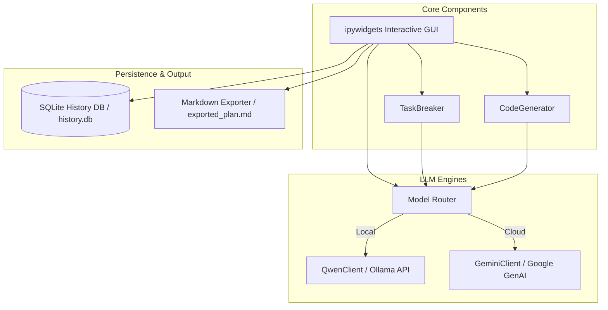

# 🚀 Local AI Code Assistant & GUI Planner

A privacy-first, local AI-powered code generator and project planner built for **Jupyter Notebook**. It features an interactive **ipywidgets** graphical user interface, powered locally by **Qwen 2.5** (via [Ollama](https://ollama.com/)) with optional cloud model fallback via **Google Gemini API**.

---

## 🌟 Key Features

- **🎨 Rich Graphical User Interface (GUI)**
  Built directly inside Jupyter using `ipywidgets` and custom CSS styling. Features model parameter controls (Engine toggle, Temperature slider, Max Tokens slider), feature text input, real-time status notifications, code output preview blocks, and plan history controls.

- **🤖 Dual-Engine Architecture (Local & Cloud)**
  - **Local Model (Default):** Qwen 2.5 (7B) running offline via Ollama. Ensures full code privacy with zero external API calls.
  - **Cloud Fallback:** Optional Google Gemini integration (`gemini-1.5-flash`) for complex cloud processing.

- **📋 Automated Task Breakdown (`TaskBreaker`)**
  Input a high-level feature description (e.g., *"REST API for a todo app with authentication"*), and the system automatically decomposes it into an ordered, dependency-aware list of actionable implementation steps.

- **💻 Step-by-Step Code Generation (`CodeGenerator`)**
  Generate production-ready code with explanations individually for each subtask with dedicated "Generate Code" action buttons.

- **💾 Persistent History Database (`HistoryDB`)**
  All plans, subtasks, generated code, and completion statuses are saved automatically to a local SQLite database (`data/history.db`). Reload or delete past planning sessions seamlessly.

- **📥 One-Click Markdown Export**
  Export complete project plans, including subtask statuses, code blocks, and explanations, into a clean downloadable `.md` file.

---

## 🏗️ Architecture Overview



---

## 🖥️ Graphical User Interface (GUI) Architecture & Layout

### 1. Interactive GUI Layout Wireframe

```
+-----------------------------------------------------------------------------------+
|                         🚀 AI Code Planner (Header Banner)                        |
|               Powered by Qwen 2.5 (local) + Optional Gemini API                   |
+-----------------------------------------------------------------------------------+
|  ⚙️ Settings Panel                                                                 |
|  Engine:      [ local  v ]                                                        |
|  Temp:        [========|=======] 0.7                                              |
|  Max Tokens:  [======|=========] 2048                                             |
+-----------------------------------------------------------------------------------+
|  ✍️ Feature Description Input                                                     |
|  +-----------------------------------------------------------------------------+  |
|  | Build a REST API for a todo app with authentication                         |  |
|  +-----------------------------------------------------------------------------+  |
|  [ ⚡ Generate Plan ]                                                              |
+-----------------------------------------------------------------------------------+
|  📋 Task List Output Area (plan_output)                                           |
|  +-----------------------------------------------------------------------------+  |
|  | [STATUS] Generated 3 tasks                                                  |  |
|  | [TODO] 1. Design database schema for user auth & todo items                 |  |
|  | [ ⚙️ Generate Code for Task 1 ]                                              |  |
|  | [DONE] 2. Create authentication routes and JWT token validation             |  |
|  | [ ⚙️ Generate Code for Task 2 ]                                              |  |
|  +-----------------------------------------------------------------------------+  |
+-----------------------------------------------------------------------------------+
|  💻 Generated Code Output Area (code_output)                                      |
|  +-----------------------------------------------------------------------------+  |
|  | Task 2 - Code                                                               |  |
|  | +-------------------------------------------------------------------------+ |  |
|  | | from flask import Flask, request, jsonify...                            | |  |
|  | +-------------------------------------------------------------------------+ |  |
|  | Explanation: Validates credentials and returns JWT bearer token...        |  |
|  +-----------------------------------------------------------------------------+  |
+-----------------------------------------------------------------------------------+
|  [ 📥 Export Plan as .md ]                                                        |
|  Download: exported_plan.md                                                       |
+-----------------------------------------------------------------------------------+
|  💾 Plan History Controls                                                         |
|  History: [ Todo API Plan (2026-07-29) v ]   [ 📂 Load ]   [ 🗑️ Delete ]             |
+-----------------------------------------------------------------------------------+
```

### 2. GUI Component & Event Flow Architecture

```mermaid
graph TD
    subgraph GUI ["🖥️ ipywidgets GUI Front-End"]
        direction TB
        
        subgraph PANEL_1 ["1️⃣ Header & Control Panel"]
            HDR["Header Banner<br/>(CSS styled HTML)"]
            ENG["Engine Dropdown<br/>(engine_dropdown)"]
            TMP["Temp Slider<br/>(temperature_slider)"]
            TOK["Tokens Slider<br/>(max_tokens_slider)"]
        end
        
        subgraph PANEL_2 ["2️⃣ Feature Input"]
            INP["Textarea Input<br/>(feature_input)"]
            BTN_P["Generate Plan Button<br/>(generate_plan_btn)"]
        end
        
        subgraph PANEL_3 ["3️⃣ Plan & Task View"]
            OUT_P["Plan Output Container<br/>(plan_output)"]
            TSK_BADGE["Task Status Item Cards<br/>([TODO] / [DONE])"]
            BTN_C["Generate Code Buttons<br/>(gen_btn per task)"]
        end

        subgraph PANEL_4 ["4️⃣ Code Display View"]
            OUT_C["Code Output Container<br/>(code_output)"]
            BOX_C["Dark Monospace Output Box<br/>(.code-output)"]
            EXP_C["Code Explanation Box"]
        end

        subgraph PANEL_5 ["5️⃣ Export & History"]
            BTN_E["Export Button<br/>(export_btn)"]
            LINK_E["File Link Output<br/>(FileLink)"]
            DD_H["History Dropdown<br/>(history_dropdown)"]
            BTN_L["Load Button<br/>(load_history_btn)"]
            BTN_D["Delete Button<br/>(delete_history_btn)"]
        end
    end

    subgraph STATE ["🔄 Application Reactive State"]
        PLAN_STATE["current_plan<br/>{ id, description, tasks, engine }"]
    end

    subgraph HANDLERS ["⚡ Event Handlers"]
        H_GEN_PLAN["on_generate_plan(btn)"]
        H_GEN_CODE["on_generate_code(task_idx)"]
        H_EXPORT["on_export(btn)"]
        H_LOAD["on_load_history(btn)"]
        H_DELETE["on_delete_history(btn)"]
    end

    subgraph SERVICES ["⚙️ Core Backend Logic"]
        TB_MOD["TaskBreaker"]
        CG_MOD["CodeGenerator"]
        RTR_MOD["Router Engine"]
        DB_MOD["HistoryDB (SQLite)"]
    end

    %% User Interaction bindings
    BTN_P -->|Click| H_GEN_PLAN
    BTN_C -->|Click| H_GEN_CODE
    BTN_E -->|Click| H_EXPORT
    BTN_L -->|Click| H_LOAD
    BTN_D -->|Click| H_DELETE

    %% Event Handler Execution logic
    H_GEN_PLAN -->|Reads Input & Engine| INP
    H_GEN_PLAN -->|Decomposes Feature| TB_MOD
    H_GEN_PLAN -->|Persists Initial Plan| DB_MOD
    H_GEN_PLAN -->|Updates| PLAN_STATE
    H_GEN_PLAN -->|Renders Tasks| OUT_P

    H_GEN_CODE -->|Generates Code| CG_MOD
    H_GEN_CODE -->|Updates Status & Code| DB_MOD
    H_GEN_CODE -->|Updates| PLAN_STATE
    H_GEN_CODE -->|Renders Code & Explanations| OUT_C
    H_GEN_CODE -->|Re-renders Task Status| OUT_P

    H_EXPORT -->|Reads State & Writes File| PLAN_STATE
    H_EXPORT -->|Renders Link| LINK_E

    H_LOAD -->|Fetches Record by ID| DB_MOD
    H_LOAD -->|Restores State & Widgets| PLAN_STATE
    H_LOAD -->|Re-renders UI Output| OUT_P

    H_DELETE -->|Removes Record| DB_MOD
    H_DELETE -->|Refreshes Dropdown| DD_H

    %% Service connections
    TB_MOD --> RTR_MOD
    CG_MOD --> RTR_MOD
```



---

## 🗂️ Project Structure

```
ai llm rag/
├── ai_code_assistant.ipynb   # Main Jupyter Notebook containing full GUI & application logic
├── Dockerfile                # Container definition for Jupyter & AI Code Assistant
├── docker-compose.yml        # Docker Compose configuration with volume & host mapping
├── .dockerignore             # Docker build exclusion rules
├── requirements.txt          # Python dependencies
├── .env.example              # Template environment file
├── .env                      # Active environment configuration (git-ignored)
├── changes.md                # Implementation notes & Streamlit -> Jupyter migration details
├── README.md                 # Project documentation
└── data/
    └── history.db            # SQLite database storing session history (auto-created)
```

---

## ⚙️ Prerequisites & Setup

### 1. Install & Run Ollama (For Local Qwen 2.5)

1. **Install Ollama**:
   ```bash
   curl -fsSL https://ollama.com/install.sh | sh
   ```
2. **Pull the Qwen 2.5 Model**:
   ```bash
   ollama pull qwen2.5:7b
   ```
3. **Ensure Ollama is running**:
   ```bash
   ollama serve
   ```

### 2. Install Python Dependencies

Create a virtual environment (optional) and install dependencies:

```bash
pip install -r requirements.txt
```

*Required packages:*
- `ipywidgets` (Interactive notebook GUI)
- `jupyter` (Notebook environment)
- `requests` (HTTP requests to Ollama API)
- `google-generativeai` (Gemini API client)
- `python-dotenv` (Environment variable management)

---

## 🔑 Environment Configuration

Create a `.env` file in the project root by copying `.env.example`:

```bash
cp .env.example .env
```

Configure parameters inside `.env`:

```ini
# Ollama settings
OLLAMA_HOST=http://localhost:11434
QWEN_MODEL=qwen2.5:7b

# Gemini Cloud Fallback (Optional)
GEMINI_API_KEY=your_gemini_api_key_here
GEMINI_MODEL=gemini-1.5-flash

# Application Default Settings
DEFAULT_ENGINE=local
APP_TITLE=AI Code Planner
```

---

## 🐳 Docker Setup & Containerization

You can run the entire Jupyter GUI environment inside a isolated Docker container with zero setup of local Python virtual environments.

### 1. Using Docker Compose (Recommended)

Start the application with a single command:

```bash
docker compose up --build
```

- **Jupyter URL:** Open [http://localhost:8888](http://localhost:8888) in your browser.
- **Database Persistence:** History database (`data/history.db`) is mounted from host to retain past sessions.
- **Ollama Connectivity:** Container automatically maps `host.docker.internal` to connect with Ollama running on your host machine (`OLLAMA_HOST=http://host.docker.internal:11434`).

To stop the container:
```bash
docker compose down
```

### 2. Using Standalone Docker CLI

Build the Docker image:
```bash
docker build -t ai-code-planner .
```

Run the container:
```bash
docker run -d \
  -p 8888:8888 \
  -v "$(pwd)/data:/app/data" \
  --add-host=host.docker.internal:host-gateway \
  --env-file .env \
  --name ai_code_planner \
  ai-code-planner
```

---

## 🚀 How to Launch and Use the GUI

1. **Start Jupyter Notebook**:
   ```bash
   jupyter notebook ai_code_assistant.ipynb
   ```

2. **Execute Notebook Cells**:
   - Run cells 1 through 11 sequentially.
   - Cell 11 initializes and renders the full interactive graphical interface.

3. **Using the GUI**:
   - **Configure Settings:** Choose between `local` (Qwen) or `gemini` engine, adjust temperature, and set maximum output tokens.
   - **Describe Feature:** Enter your target software feature in the feature text area.
   - **Generate Plan:** Click **Generate Plan** to break down the request into steps.
   - **Generate Code per Task:** Click **Generate Code for Task N** next to any subtask to produce runnable code and logic explanations.
   - **Export:** Click **Export Plan as .md** to save and download your complete code plan.
   - **History Control:** Use the **Plan History** dropdown to reload or delete prior sessions.

---

## 📄 License

This project is open-source and free to use for personal and development workflows.
